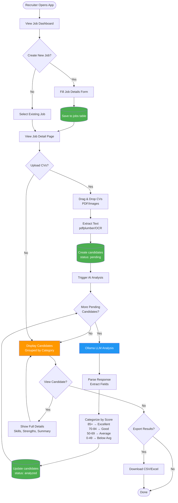
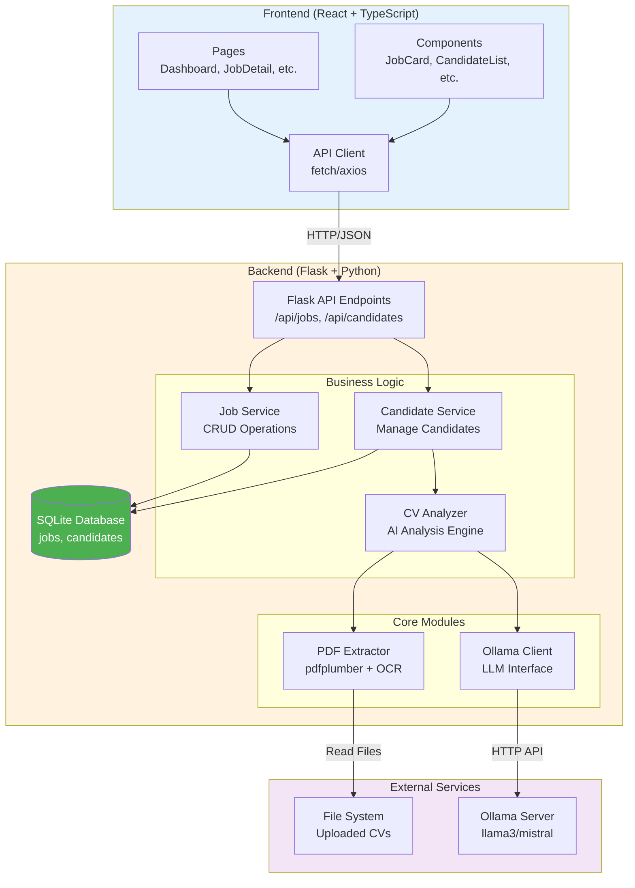
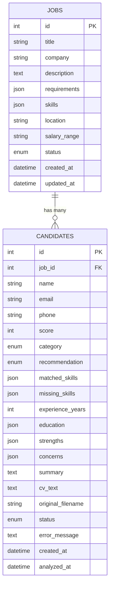
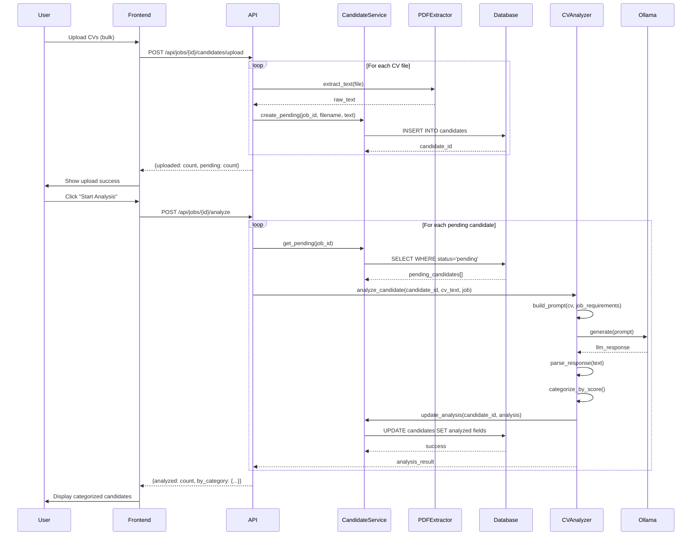
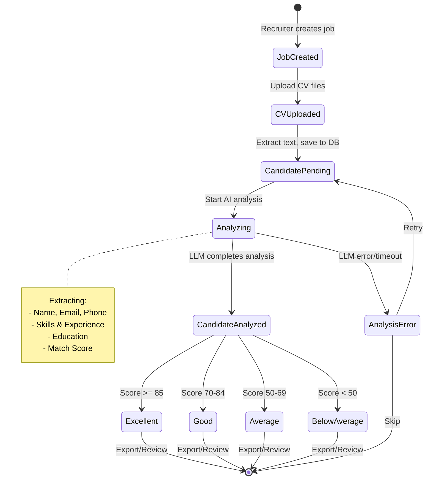

# Implementation Plan V2: Job-Centric CV Screening System

## Overview

A local, privacy-focused CV screening tool for recruiters with **persistent job management** and **SQLite storage**. Built with Python/Flask backend and React/TypeScript frontend, using Ollama for local LLM inference.

### Key Changes from V1
| Aspect | V1 | V2 |
|--------|----|----|
| Workflow | Single screening session | Persistent job listings |
| Storage | In-memory/transient | SQLite database |
| Job Management | None | Full CRUD operations |
| Candidate Storage | Session only | Permanent with history |
| CV Analysis | One-time | Stored & retrievable |

---

## Part 1: New Workflow

### User Journey

```
1. Recruiter creates a Job Listing
   └── Enters: Title, Description, Requirements, Skills, Company

2. Recruiter opens Job Details page
   └── Sees: Job info, Upload area, Candidate list (if any)

3. Recruiter uploads CVs (bulk - PDF/Images)
   └── System: Saves files, queues for analysis

4. AI analyzes each CV
   └── Extracts: Name, Email, Phone, Skills, Experience, Education
   └── Scores: Match percentage against job requirements
   └── Categorizes: Excellent/Good/Average/Below Average

5. Results stored in SQLite
   └── Candidate record linked to Job
   └── Standardized format for all candidates

6. Recruiter views candidates
   └── Filter by category, sort by score
   └── Click to see full candidate details
   └── Export shortlist
```

### Workflow Diagram



### System Architecture



### Database Schema (ERD)



### CV Analysis Process Sequence



### State Transitions



---

## Part 2: Database Schema

### SQLite Tables

```sql
-- Jobs table
CREATE TABLE jobs (
    id INTEGER PRIMARY KEY AUTOINCREMENT,
    title TEXT NOT NULL,
    company TEXT NOT NULL,
    description TEXT NOT NULL,
    requirements TEXT NOT NULL,  -- JSON array
    skills TEXT NOT NULL,        -- JSON array
    location TEXT,
    salary_range TEXT,
    status TEXT DEFAULT 'active', -- active, closed, draft
    created_at DATETIME DEFAULT CURRENT_TIMESTAMP,
    updated_at DATETIME DEFAULT CURRENT_TIMESTAMP
);

-- Candidates table
CREATE TABLE candidates (
    id INTEGER PRIMARY KEY AUTOINCREMENT,
    job_id INTEGER NOT NULL,
    
    -- Extracted Info (standardized format)
    name TEXT NOT NULL,
    email TEXT,
    phone TEXT,
    
    -- AI Analysis Results
    score INTEGER NOT NULL,           -- 0-100
    category TEXT NOT NULL,           -- excellent, good, average, below_average
    recommendation TEXT NOT NULL,     -- SHORTLIST, CONSIDER, PASS
    
    -- Detailed Analysis (JSON)
    matched_skills TEXT,              -- JSON array
    missing_skills TEXT,              -- JSON array
    experience_years INTEGER,
    education TEXT,                   -- JSON object
    strengths TEXT,                   -- JSON array
    concerns TEXT,                    -- JSON array
    summary TEXT,
    
    -- Raw Data
    cv_text TEXT,                     -- Extracted text from CV
    original_filename TEXT,
    
    -- Metadata
    status TEXT DEFAULT 'pending',    -- pending, analyzed, error
    error_message TEXT,
    created_at DATETIME DEFAULT CURRENT_TIMESTAMP,
    analyzed_at DATETIME,
    
    FOREIGN KEY (job_id) REFERENCES jobs(id) ON DELETE CASCADE
);

-- Analysis logs for debugging
CREATE TABLE analysis_logs (
    id INTEGER PRIMARY KEY AUTOINCREMENT,
    candidate_id INTEGER NOT NULL,
    llm_prompt TEXT,
    llm_response TEXT,
    processing_time_ms INTEGER,
    created_at DATETIME DEFAULT CURRENT_TIMESTAMP,
    FOREIGN KEY (candidate_id) REFERENCES candidates(id) ON DELETE CASCADE
);
```

---

## Part 3: Updated Project Structure

```
Local-AI-Resume-Analyzer/
├── backend/
│   ├── app.py                      # Flask application
│   ├── requirements.txt
│   ├── .env.example
│   ├── src/
│   │   ├── __init__.py
│   │   ├── database/
│   │   │   ├── __init__.py
│   │   │   ├── db.py               # SQLite connection manager
│   │   │   ├── models.py           # SQLAlchemy models
│   │   │   └── migrations.py       # Schema setup
│   │   ├── core/
│   │   │   ├── __init__.py
│   │   │   └── pdf_extractor.py    # PDF/Image text extraction
│   │   ├── services/
│   │   │   ├── __init__.py
│   │   │   ├── ollama_client.py    # LLM interface
│   │   │   ├── cv_analyzer.py      # CV analysis engine
│   │   │   ├── job_service.py      # Job CRUD operations
│   │   │   └── candidate_service.py # Candidate operations
│   │   ├── api/
│   │   │   ├── __init__.py
│   │   │   ├── jobs.py             # Job endpoints
│   │   │   ├── candidates.py       # Candidate endpoints
│   │   │   └── analysis.py         # Analysis endpoints
│   │   └── utils/
│   │       ├── __init__.py
│   │       ├── config.py
│   │       └── export.py           # CSV/Excel export
│   ├── storage/
│   │   └── app.db                  # SQLite database
│   ├── uploads/                    # Temporary CV files
│   └── tests/
├── frontend/
│   ├── src/
│   │   ├── components/
│   │   │   ├── ui/                 # Shadcn components
│   │   │   ├── jobs/
│   │   │   │   ├── JobCard.tsx
│   │   │   │   ├── JobForm.tsx
│   │   │   │   └── JobList.tsx
│   │   │   ├── candidates/
│   │   │   │   ├── CandidateCard.tsx
│   │   │   │   ├── CandidateList.tsx
│   │   │   │   ├── CandidateDetail.tsx
│   │   │   │   └── CategoryGroup.tsx
│   │   │   ├── upload/
│   │   │   │   ├── CVUploader.tsx
│   │   │   │   └── UploadProgress.tsx
│   │   │   └── layout/
│   │   ├── pages/
│   │   │   ├── Dashboard.tsx       # Job listings
│   │   │   ├── JobCreate.tsx       # Create new job
│   │   │   ├── JobDetail.tsx       # Job + candidates view
│   │   │   ├── CandidateView.tsx   # Single candidate detail
│   │   │   └── Settings.tsx
│   │   ├── lib/
│   │   │   ├── api.ts              # API client
│   │   │   └── types.ts            # TypeScript types
│   │   ├── App.tsx
│   │   └── main.tsx
│   └── package.json
└── README.md
```

---

## Part 4: API Endpoints

### Jobs API

| Method | Endpoint | Description |
|--------|----------|-------------|
| GET | `/api/jobs` | List all jobs |
| POST | `/api/jobs` | Create new job |
| GET | `/api/jobs/:id` | Get job details |
| PUT | `/api/jobs/:id` | Update job |
| DELETE | `/api/jobs/:id` | Delete job |
| GET | `/api/jobs/:id/stats` | Get job statistics |

### Candidates API

| Method | Endpoint | Description |
|--------|----------|-------------|
| GET | `/api/jobs/:id/candidates` | List candidates for job |
| POST | `/api/jobs/:id/candidates/upload` | Upload CVs for analysis |
| GET | `/api/candidates/:id` | Get candidate details |
| DELETE | `/api/candidates/:id` | Delete candidate |
| GET | `/api/jobs/:id/export` | Export candidates (CSV/Excel) |

### Analysis API

| Method | Endpoint | Description |
|--------|----------|-------------|
| POST | `/api/jobs/:id/analyze` | Start/resume analysis |
| GET | `/api/jobs/:id/analyze/status` | Get analysis progress |

---

## Part 5: Backend Implementation

### 5.1 Database Manager

**File:** `backend/src/database/db.py`

```python
import sqlite3
import json
from contextlib import contextmanager
from pathlib import Path

DATABASE_PATH = Path(__file__).parent.parent.parent / 'storage' / 'app.db'

def init_db():
    """Initialize database with schema"""
    DATABASE_PATH.parent.mkdir(exist_ok=True)
    with get_db() as conn:
        conn.executescript('''
            CREATE TABLE IF NOT EXISTS jobs (
                id INTEGER PRIMARY KEY AUTOINCREMENT,
                title TEXT NOT NULL,
                company TEXT NOT NULL,
                description TEXT NOT NULL,
                requirements TEXT NOT NULL,
                skills TEXT NOT NULL,
                location TEXT,
                salary_range TEXT,
                status TEXT DEFAULT 'active',
                created_at DATETIME DEFAULT CURRENT_TIMESTAMP,
                updated_at DATETIME DEFAULT CURRENT_TIMESTAMP
            );
            
            CREATE TABLE IF NOT EXISTS candidates (
                id INTEGER PRIMARY KEY AUTOINCREMENT,
                job_id INTEGER NOT NULL,
                name TEXT NOT NULL,
                email TEXT,
                phone TEXT,
                score INTEGER NOT NULL DEFAULT 0,
                category TEXT NOT NULL DEFAULT 'pending',
                recommendation TEXT DEFAULT 'PENDING',
                matched_skills TEXT,
                missing_skills TEXT,
                experience_years INTEGER,
                education TEXT,
                strengths TEXT,
                concerns TEXT,
                summary TEXT,
                cv_text TEXT,
                original_filename TEXT,
                status TEXT DEFAULT 'pending',
                error_message TEXT,
                created_at DATETIME DEFAULT CURRENT_TIMESTAMP,
                analyzed_at DATETIME,
                FOREIGN KEY (job_id) REFERENCES jobs(id) ON DELETE CASCADE
            );
            
            CREATE INDEX IF NOT EXISTS idx_candidates_job ON candidates(job_id);
            CREATE INDEX IF NOT EXISTS idx_candidates_category ON candidates(category);
        ''')

@contextmanager
def get_db():
    """Get database connection with row factory"""
    conn = sqlite3.connect(DATABASE_PATH)
    conn.row_factory = sqlite3.Row
    conn.execute('PRAGMA foreign_keys = ON')
    try:
        yield conn
        conn.commit()
    except Exception:
        conn.rollback()
        raise
    finally:
        conn.close()
```

### 5.2 Job Service

**File:** `backend/src/services/job_service.py`

```python
import json
from typing import List, Optional, Dict
from src.database.db import get_db

class JobService:
    
    @staticmethod
    def create(data: Dict) -> int:
        """Create a new job listing"""
        with get_db() as conn:
            cursor = conn.execute('''
                INSERT INTO jobs (title, company, description, requirements, skills, location, salary_range)
                VALUES (?, ?, ?, ?, ?, ?, ?)
            ''', (
                data['title'],
                data['company'],
                data['description'],
                json.dumps(data.get('requirements', [])),
                json.dumps(data.get('skills', [])),
                data.get('location'),
                data.get('salary_range')
            ))
            return cursor.lastrowid
    
    @staticmethod
    def get_all() -> List[Dict]:
        """Get all jobs with candidate counts"""
        with get_db() as conn:
            rows = conn.execute('''
                SELECT j.*, 
                    COUNT(c.id) as total_candidates,
                    SUM(CASE WHEN c.category = 'excellent' THEN 1 ELSE 0 END) as excellent_count,
                    SUM(CASE WHEN c.category = 'good' THEN 1 ELSE 0 END) as good_count
                FROM jobs j
                LEFT JOIN candidates c ON j.id = c.job_id AND c.status = 'analyzed'
                GROUP BY j.id
                ORDER BY j.created_at DESC
            ''').fetchall()
            return [JobService._row_to_dict(row) for row in rows]
    
    @staticmethod
    def get_by_id(job_id: int) -> Optional[Dict]:
        """Get job by ID with full details"""
        with get_db() as conn:
            row = conn.execute('SELECT * FROM jobs WHERE id = ?', (job_id,)).fetchone()
            return JobService._row_to_dict(row) if row else None
    
    @staticmethod
    def update(job_id: int, data: Dict) -> bool:
        """Update job listing"""
        with get_db() as conn:
            conn.execute('''
                UPDATE jobs SET 
                    title = ?, company = ?, description = ?,
                    requirements = ?, skills = ?, location = ?,
                    salary_range = ?, status = ?,
                    updated_at = CURRENT_TIMESTAMP
                WHERE id = ?
            ''', (
                data['title'], data['company'], data['description'],
                json.dumps(data.get('requirements', [])),
                json.dumps(data.get('skills', [])),
                data.get('location'), data.get('salary_range'),
                data.get('status', 'active'), job_id
            ))
            return True
    
    @staticmethod
    def delete(job_id: int) -> bool:
        """Delete job and all associated candidates"""
        with get_db() as conn:
            conn.execute('DELETE FROM jobs WHERE id = ?', (job_id,))
            return True
    
    @staticmethod
    def _row_to_dict(row) -> Dict:
        """Convert SQLite row to dictionary"""
        if not row:
            return None
        d = dict(row)
        d['requirements'] = json.loads(d.get('requirements') or '[]')
        d['skills'] = json.loads(d.get('skills') or '[]')
        return d
```

### 5.3 Candidate Service

**File:** `backend/src/services/candidate_service.py`

```python
import json
from typing import List, Optional, Dict
from src.database.db import get_db

class CandidateService:
    
    @staticmethod
    def create_pending(job_id: int, filename: str, cv_text: str) -> int:
        """Create pending candidate record"""
        with get_db() as conn:
            cursor = conn.execute('''
                INSERT INTO candidates (job_id, name, original_filename, cv_text, status)
                VALUES (?, 'Pending Analysis', ?, ?, 'pending')
            ''', (job_id, filename, cv_text))
            return cursor.lastrowid
    
    @staticmethod
    def update_analysis(candidate_id: int, analysis: Dict):
        """Update candidate with analysis results"""
        with get_db() as conn:
            conn.execute('''
                UPDATE candidates SET
                    name = ?, email = ?, phone = ?,
                    score = ?, category = ?, recommendation = ?,
                    matched_skills = ?, missing_skills = ?,
                    experience_years = ?, education = ?,
                    strengths = ?, concerns = ?, summary = ?,
                    status = 'analyzed',
                    analyzed_at = CURRENT_TIMESTAMP
                WHERE id = ?
            ''', (
                analysis.get('name', 'Unknown'),
                analysis.get('email'),
                analysis.get('phone'),
                analysis.get('score', 0),
                analysis.get('category', 'below_average'),
                analysis.get('recommendation', 'PASS'),
                json.dumps(analysis.get('matched_skills', [])),
                json.dumps(analysis.get('missing_skills', [])),
                analysis.get('experience_years', 0),
                json.dumps(analysis.get('education', {})),
                json.dumps(analysis.get('strengths', [])),
                json.dumps(analysis.get('concerns', [])),
                analysis.get('summary', ''),
                candidate_id
            ))
    
    @staticmethod
    def get_by_job(job_id: int, category: str = None) -> List[Dict]:
        """Get all candidates for a job"""
        with get_db() as conn:
            query = 'SELECT * FROM candidates WHERE job_id = ?'
            params = [job_id]
            if category:
                query += ' AND category = ?'
                params.append(category)
            query += ' ORDER BY score DESC'
            rows = conn.execute(query, params).fetchall()
            return [CandidateService._row_to_dict(row) for row in rows]
    
    @staticmethod
    def get_by_id(candidate_id: int) -> Optional[Dict]:
        """Get candidate by ID"""
        with get_db() as conn:
            row = conn.execute(
                'SELECT * FROM candidates WHERE id = ?', 
                (candidate_id,)
            ).fetchone()
            return CandidateService._row_to_dict(row) if row else None
    
    @staticmethod
    def get_pending(job_id: int) -> List[Dict]:
        """Get pending candidates for analysis"""
        with get_db() as conn:
            rows = conn.execute('''
                SELECT id, cv_text, original_filename 
                FROM candidates 
                WHERE job_id = ? AND status = 'pending'
            ''', (job_id,)).fetchall()
            return [dict(row) for row in rows]
    
    @staticmethod
    def _row_to_dict(row) -> Dict:
        """Convert row to dictionary with JSON parsing"""
        if not row:
            return None
        d = dict(row)
        for field in ['matched_skills', 'missing_skills', 'strengths', 'concerns']:
            d[field] = json.loads(d.get(field) or '[]')
        d['education'] = json.loads(d.get('education') or '{}')
        return d
```

### 5.4 CV Analyzer

**File:** `backend/src/services/cv_analyzer.py`

```python
from typing import Dict
from src.services.ollama_client import OllamaClient
from src.services.candidate_service import CandidateService
import re

class CVAnalyzer:
    """Analyze CVs against job requirements"""
    
    CATEGORY_THRESHOLDS = {
        'excellent': 85,
        'good': 70,
        'average': 50,
        'below_average': 0
    }
    
    def __init__(self):
        self.ollama = OllamaClient()
    
    def analyze_candidate(self, candidate_id: int, cv_text: str, job: Dict) -> Dict:
        """Analyze a single candidate CV"""
        prompt = self._build_prompt(cv_text, job)
        response = self.ollama.generate(prompt=prompt, temperature=0.3)
        analysis = self._parse_response(response)
        analysis['category'] = self._get_category(analysis['score'])
        
        # Save to database
        CandidateService.update_analysis(candidate_id, analysis)
        return analysis
    
    def _build_prompt(self, cv_text: str, job: Dict) -> str:
        reqs = '\n'.join(f"- {r}" for r in job.get('requirements', []))
        skills = ', '.join(job.get('skills', []))
        
        return f"""You are an expert HR recruiter. Analyze this CV for the position.

**Job Title:** {job['title']}
**Company:** {job['company']}

**Job Description:**
{job['description']}

**Required Qualifications:**
{reqs}

**Desired Skills:** {skills}

**CANDIDATE CV:**
{cv_text}

**Provide analysis in EXACTLY this format:**
Name: [full name]
Email: [email if found]
Phone: [phone if found]
Match Score: [0-100]
Experience Years: [number]
Matched Skills: [skill1, skill2, skill3]
Missing Skills: [skill1, skill2]
Education: [highest degree and field]
Key Strengths:
• [strength1]
• [strength2]
• [strength3]
Concerns:
• [concern1]
• [concern2]
Recommendation: [SHORTLIST/CONSIDER/PASS]
Summary: [2-3 sentence assessment]"""

    def _parse_response(self, response: str) -> Dict:
        """Parse LLM response into structured data"""
        def extract(pattern, default=''):
            match = re.search(pattern, response, re.I)
            return match.group(1).strip() if match else default
        
        def extract_list(pattern):
            match = re.search(pattern, response, re.I)
            if match:
                return [s.strip() for s in match.group(1).split(',') if s.strip()]
            return []
        
        def extract_bullets(header):
            pattern = rf'{header}:\s*\n((?:•[^\n]+\n?)+)'
            match = re.search(pattern, response, re.I)
            if match:
                return [s.strip('• ').strip() for s in match.group(1).split('\n') if s.strip()]
            return []
        
        score_str = extract(r'Match Score:\s*(\d+)', '0')
        
        return {
            'name': extract(r'Name:\s*(.+)'),
            'email': extract(r'Email:\s*([^\s]+@[^\s]+)'),
            'phone': extract(r'Phone:\s*([+\d\s\-()]+)'),
            'score': int(score_str) if score_str.isdigit() else 0,
            'experience_years': int(extract(r'Experience Years:\s*(\d+)', '0') or 0),
            'matched_skills': extract_list(r'Matched Skills:\s*(.+)'),
            'missing_skills': extract_list(r'Missing Skills:\s*(.+)'),
            'education': {'summary': extract(r'Education:\s*(.+)')},
            'strengths': extract_bullets('Key Strengths'),
            'concerns': extract_bullets('Concerns'),
            'recommendation': extract(r'Recommendation:\s*(SHORTLIST|CONSIDER|PASS)', 'PASS'),
            'summary': extract(r'Summary:\s*(.+?)(?:\n\n|$)')
        }
    
    def _get_category(self, score: int) -> str:
        for cat, threshold in self.CATEGORY_THRESHOLDS.items():
            if score >= threshold:
                return cat
        return 'below_average'
```

---

## Part 6: Frontend Pages

### 6.1 Dashboard (Job List)

**Route:** `/`

Features:
- Grid/List view of all jobs
- Each job card shows: Title, Company, Date, Candidate counts by category
- Quick actions: View, Edit, Delete
- "Create New Job" button

### 6.2 Job Create/Edit

**Route:** `/jobs/new` and `/jobs/:id/edit`

Form fields:
- Job Title (required)
- Company Name (required)
- Job Description (textarea, required)
- Requirements (multi-line, one per line)
- Skills (tags/chips input)
- Location (optional)
- Salary Range (optional)

### 6.3 Job Detail

**Route:** `/jobs/:id`

Layout:
- Header: Job title, company, status, stats
- CV Upload Section: Drag & drop zone for bulk upload
- Analysis Progress: Shows pending/completed counts
- Candidate Groups: Tabbed view by category
  - Excellent (85-100)
  - Good (70-84)
  - Average (50-69)
  - Below Average (0-49)
- Each candidate shows: Name, Score, Recommendation badge
- Click candidate → Slide-in detail panel

### 6.4 Candidate Detail

**Route:** `/candidates/:id` (or modal/drawer)

Shows:
- Name, Contact info
- Score with visual indicator
- Matched/Missing skills
- Experience summary
- Education
- Strengths & Concerns
- AI Summary
- Original filename
- Analyzed timestamp

---

## Part 7: TypeScript Types

**File:** `frontend/src/lib/types.ts`

```typescript
export type JobStatus = 'active' | 'closed' | 'draft';
export type CandidateCategory = 'excellent' | 'good' | 'average' | 'below_average' | 'pending';
export type Recommendation = 'SHORTLIST' | 'CONSIDER' | 'PASS' | 'PENDING';

export interface Job {
  id: number;
  title: string;
  company: string;
  description: string;
  requirements: string[];
  skills: string[];
  location?: string;
  salary_range?: string;
  status: JobStatus;
  created_at: string;
  updated_at: string;
  // Computed fields from API
  total_candidates?: number;
  excellent_count?: number;
  good_count?: number;
}

export interface Candidate {
  id: number;
  job_id: number;
  name: string;
  email?: string;
  phone?: string;
  score: number;
  category: CandidateCategory;
  recommendation: Recommendation;
  matched_skills: string[];
  missing_skills: string[];
  experience_years: number;
  education: { summary?: string };
  strengths: string[];
  concerns: string[];
  summary: string;
  original_filename: string;
  status: 'pending' | 'analyzed' | 'error';
  created_at: string;
  analyzed_at?: string;
}

export interface AnalysisProgress {
  job_id: number;
  total: number;
  analyzed: number;
  pending: number;
  errors: number;
}
```

---

## Part 8: Quick Start

```bash
# 1. Backend setup
cd backend
python -m venv venv
venv\Scripts\activate  # Windows
pip install -r requirements.txt
cp .env.example .env

# 2. Initialize database
python -c "from src.database.db import init_db; init_db()"

# 3. Start Ollama
ollama serve
ollama pull llama3

# 4. Run backend
python app.py

# 5. Frontend setup
cd frontend
npm install
npm run dev

# 6. Open http://localhost:5173
```

---

## Part 9: Implementation Checklist

### Backend
- [ ] Database schema & migrations
- [ ] Job CRUD endpoints
- [ ] Candidate upload endpoint
- [ ] CV text extraction (PDF + Image OCR)
- [ ] CV analysis with Ollama
- [ ] Export to CSV/Excel

### Frontend
- [ ] Dashboard with job list
- [ ] Job create/edit form
- [ ] Job detail page with upload
- [ ] Candidate list by category
- [ ] Candidate detail view
- [ ] Upload progress indicator
- [ ] Export functionality

### Testing
- [ ] Job service unit tests
- [ ] Candidate service unit tests
- [ ] API integration tests
- [ ] Frontend component tests
