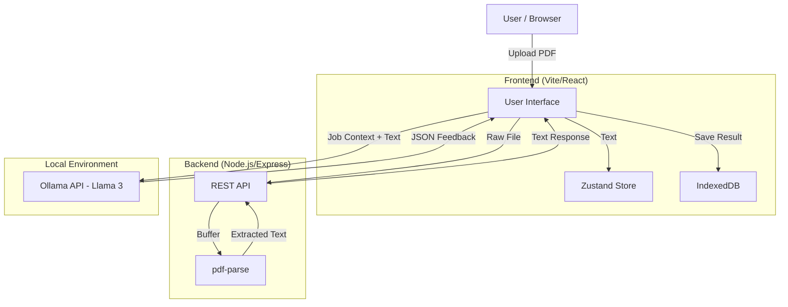

# Part 1: Product Requirement Document (PRD)

## 1. Overview & Goals

The **Local AI Resume Analyzer** is a privacy-focused web application designed to help job seekers optimize their resumes for Applicant Tracking Systems (ATS). Unlike traditional tools that process data in the cloud, this system performs all AI analysis locally on the user's machine to ensure data privacy and zero operational costs.

**Core Goals:**

- **Privacy First:** Ensure no sensitive resume data leaves the user's local network for analysis.
- **Fully Local:** All data storage happens on the user's machine—no cloud dependencies.
- **Local Intelligence:** Leverage Ollama (Llama 3/Mistral) for high-quality, free AI feedback.

## 2. User Roles & Use Cases

**Primary Role:** Job Seeker

| Use Case               | Description                                                                                                     |
| ---------------------- | --------------------------------------------------------------------------------------------------------------- |
| **History Management** | User's analysis history and preferences are stored locally in the browser.                                      |
| **Resume Upload**      | User uploads a PDF resume for analysis and backup.                                                              |
| **Job Context Input**  | User inputs the specific Company Name, Job Title, and Job Description for targeted analysis.                    |
| **View Analysis**      | User views a detailed report including ATS score, overall score, and specific feedback on structure and skills. |

## 3. Functional Requirements

### 3.1 Local Storage

- **Browser Storage:** Analysis history and user preferences are stored in IndexedDB via `idb` or `localforage`.
- **File Handling:** PDF files are processed in-memory; optionally saved to local filesystem via the backend.
- **No Auth Required:** Since all data stays local, no user authentication is needed.

### 3.2 Text Extraction

- **Server-Side Processing:** The system must extract text from PDF files using `pdf-parse` (Node.js).
- **Full Document Extraction:** The extractor retrieves all text content from the PDF in a single operation.

### 3.3 AI Integration (Ollama)

- **Local API Connection:** The application must communicate with a local Ollama instance running at `http://localhost:11434`.
- **JSON Enforcement:** The AI prompt must strictly request and enforce a JSON output format to ensure parseable results.
- **CORS Handling:** The system relies on the user configuring `OLLAMA_ORIGINS="*"` to allow browser-to-local-server communication.

## 4. Non-Functional Requirements

- **Privacy:** No resume text or job descriptions are sent to external third-party AI APIs; all inference is local.
- **Cost:** The system must operate at $0 cost—no cloud services, subscriptions, or API fees.
- **Performance:** Text extraction should happen within seconds. AI analysis time depends on the user's local hardware capabilities (GPU/CPU).
- **Compatibility:** Requires a browser capable of running modern React/Vite applications and a Node.js backend.

## 5. System Architecture & Data Flow



## 6. Edge Cases & Constraints

- **Ollama Offline:** If Ollama is not running or CORS is not configured, the `fetch` request will fail. The UI must handle this connection error gracefully.
- **PDF Parsing Errors:** Complex PDF layouts (e.g., image-based resumes) may result in empty or garbled text extraction via `pdf-parse`.
- **Model Hallucination:** The local model might generate invalid JSON despite instructions. The parsing logic needs error handling for malformed JSON responses.

---

# Part 2: AI Algorithm Design

## 1. Problem Definition

The system needs to act as an expert ATS consultant, taking unstructured resume text and a structured job description to output a quantitative score and qualitative feedback in a strict machine-readable format.

## 2. Input / Output Specification

- **Input:**
- `Resume Text` (String): Raw text extracted from PDF.
- `Job Title` (String): Target role.
- `Job Description` (String): Requirements and duties.

- **Output (JSON):**
- `overallScore` (Number): 0-100.
- `atsScore` (Number): 0-100.
- `toneAndStyle` (Object): Score + Feedback.
- `content` (Object): Score + Feedback.
- `structure` (Object): Score + Feedback.
- `skills` (Object): Score + Feedback.
- `tips` (Array<String>): Actionable improvements.

## 3. Data Preprocessing (Text Extraction)

Before the AI sees the data, the PDF must be converted to plain text.

1. **File Buffer:** Convert uploaded `File` to a `Buffer`.
2. **Parse PDF:** Pass buffer to `pdf-parse` which returns text from all pages.
3. **Text Output:** The `data.text` property contains the full extracted text with preserved structure.

## 4. Core Algorithm Logic (Prompt Engineering)

The "algorithm" relies on **Few-Shot / Instruction Tuning** via the prompt structure to force the LLM into a specific behavior.

**The Prompt Template:**

```text
System Instruction: You are an expert in ATS and resume analysis.
Constraint: Return ONLY valid JSON. No markdown. No explanations.
Output Schema: [Insert JSON Structure]

Context:
User is applying for: {jobTitle}
Job Description: {jobDescription}

Task: Analyze the following resume content.
RESUME CONTENT:
{resumeText}

```

**Logic Flow:**

1. **Context Injection:** Inject dynamic job data into the prompt.
2. **Schema Enforcement:** Provide the exact JSON skeleton in the prompt to minimize parsing errors.
3. **Inference:** Send to `http://localhost:11434/api/generate` with `format: "json"` (Ollama specific feature to enforce JSON mode).
4. **Decoding:** Parse the `response` string from the returned JSON object.

## 5. Pseudocode

```text
FUNCTION AnalyzeResume(file, jobTitle, jobDesc):
    # 1. Preprocessing
    fileBuffer = file.buffer()
    pdfData = pdfParse(fileBuffer)
    resumeText = pdfData.text

    # 2. Prompt Construction
    schema = "{ overallScore: number, tips: string[], ... }"
    prompt = f"""
        Role: ATS Expert.
        Constraint: JSON Output only.
        Schema: {schema}
        Target Job: {jobTitle}
        Description: {jobDesc}
        Resume: {resumeText}
    """

    # 3. Inference (Local AI)
    TRY:
        response = HTTP_POST(
            url="http://localhost:11434/api/generate",
            body={
                "model": "llama3",
                "prompt": prompt,
                "stream": false,
                "format": "json"
            }
        )

        IF response.status != 200:
            THROW Error("Ollama Connection Failed")

        aiRaw = response.json()

        # 4. Parsing
        analysisResult = JSON.parse(aiRaw.response)

        RETURN analysisResult

    CATCH Error:
        RETURN "Error: Ensure Ollama is running with CORS enabled."

```

## 6. Future Considerations

- **Scalability:** While currently local, the architecture allows swapping the `fetch` URL to a centralized Ollama server or OpenAI API if the user base scales beyond individual local usage.
- **Model Improvement:** Users could optionally "rate" the feedback. These ratings + resume pairs could be used to fine-tune a smaller SLM (Small Language Model) specifically for ATS scoring.
- **Data Quality:** Implement OCR (Optical Character Recognition) via Tesseract.js for resumes that are image-based (scanned), as `pdf-parse` cannot read flattened images.
- **Security:** Although data is local, browser security (XSS) is critical since the app handles file uploads. Ensure strictly typed inputs and sanitize the JSON output before rendering.
